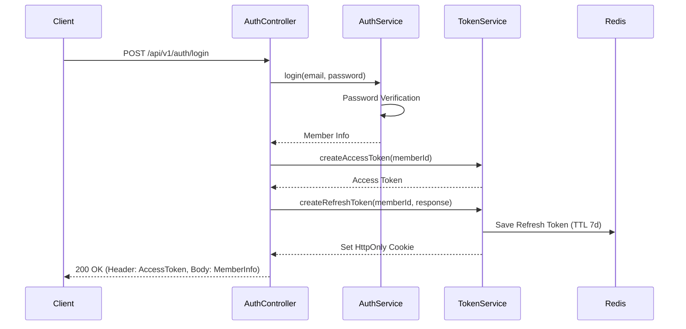
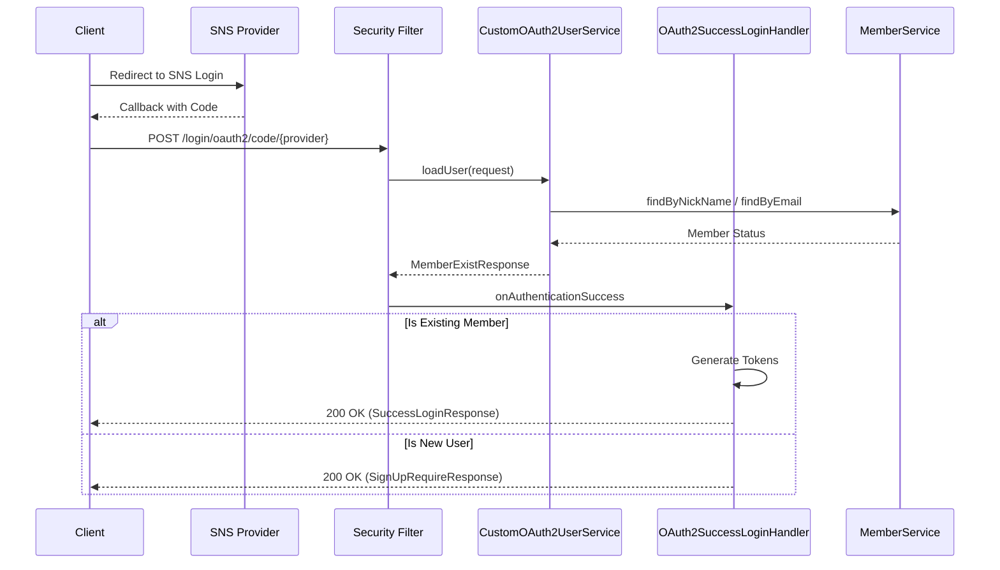

# 🔐 모각밥(Mokakbob) 로그인 및 인증 기획안

본 문서는 서비스의 회원가입, 로그인, 그리고 토큰 기반 인증 시스템의 상세 구조와 흐름을 정의합니다.

## 1. 인증 개요 (Authentication Overview)
- **방식**: JWT(JSON Web Token)를 활용한 무상태(Stateless) 기반 인증
- **전달 방식**:
    - **Access Token**: HTTP 헤더 `Authorization: Bearer {token}` 형식으로 전달
    - **Refresh Token**: `HttpOnly`, `Secure` 설정이 된 쿠키에 저장하여 보안 강화
- **보안 설정**: `SecurityConfig`를 통해 CSRF, 세션, 폼 로그인을 비활성화하고 JWT 필터를 통한 커스텀 인증 수행

## 2. 로그인 및 회원가입 (Login & Sign-up)

### 2.1 이메일 계정 기반 (Email/Password)
- **흐름**:
    1. 사용자가 이메일과 비밀번호로 로그인 요청 (`POST /api/v1/auth/login`)
    2. `AuthService`에서 `PasswordEncoder`를 사용해 비밀번호 검증
    3. 인증 성공 시 `TokenService`를 통해 Access/Refresh 토큰 발급 및 응답

### 2.2 소셜 로그인 (OAuth2)
- **현재 구현 상태**: GitHub 연동을 기반으로 구현되어 있음 (전략 패턴 적용)
- **동작 방식**: 
    1. `CustomOAuth2UserService`가 `OAuth2UserInfoFactory`를 통해 제공자별 정보 처리
    2. 기존 회원 여부를 확인하여 `OAuth2SuccessLoginHandler`로 전달
    3. **기존 회원**: 즉시 토큰을 발급하고 로그인 성공 응답 반환
    4. **신규 회원**: 회원가입이 필요함을 알리는 응답(`SignUpRequireResponse`)과 함께 기본 프로필 정보 전달

## 3. 토큰 관리 정책 (Token Management)

### 3.1 토큰 사양
- **Access Token**: 짧은 유효 기간을 가지며 실제 자원 접근에 사용
- **Refresh Token**: 긴 유효 기간(기본 7일)을 가지며 Access Token 재발급 시 사용

### 3.2 저장 및 재발급
- **저장소**: Refresh Token은 Redis에 `memberId`를 키로 하여 저장
- **재발급 흐름**:
    - `POST /api/v1/auth/reissue` 호출 시 쿠키에서 Refresh Token을 추출하여 검증
    - 유효할 경우 새로운 Access/Refresh 토큰 세트 발급 (Refresh Token Rotation 적용)

## 4. 보안 가드레일 (Security Guardrails)
- **필터 체인 구성**:
    1. `ExceptionHandlingFilter`: 인증 과정에서 발생하는 예외를 공통 응답으로 변환
    2. `JwtAuthenticationFilter`: 요청 헤더의 JWT를 검증하고 `SecurityContext`에 인증 정보 설정 (블랙리스트 체크 포함)
- **비밀번호**: BCrypt 해시 알고리즘을 사용하여 안전하게 암호화 저장

---

## 5. 리팩터링 및 보안 강화 결과 (Refactoring Results) [DONE]

### 5.1 소셜 로그인 전략 패턴 (Strategy Pattern)
- **구현**: `OAuth2UserInfo` 인터페이스와 `OAuth2UserInfoFactory`를 도입하여 다중 소셜 로그인 제공자 지원 구조를 확립하였습니다.
- **레이어**: `service.oauth2.info` 패키지 하위로 배치하여 서비스 레이어의 역할을 명확히 하였습니다.

### 5.2 사용자 정보 추출 표준화 (SecurityContext)
- **구현**: `AuthArgumentResolver`가 더 이상 `HttpServletRequest`에 의존하지 않고 `SecurityContextHolder`를 직접 참조하여 `memberId`를 추출합니다.

### 5.3 무결점 로그아웃 및 블랙리스트 (Blacklisting)
- **전략**: `Security First` 정책에 따라 모든 인증된 요청(`GET`, `POST` 등 전수 체크)에 대해 Redis 블랙리스트를 확인합니다.
- **구현**: `POST /api/v1/auth/logout` 호출 시 액세스 토큰의 남은 TTL만큼 Redis에 등록하여 즉각적인 무효화를 실현합니다.

---

## ✅ 최종 검증 결과
- **컴파일**: 전 모듈 100% 빌드 성공.
- **보안**: 로그아웃 토큰에 대해 `401 Unauthorized (LOGOUT_ACCESS_TOKEN)` 응답 체계 구축 완료.
- **확장성**: 타 플랫폼(Google, Kakao 등) 추가 시 코드 수정 최소화 구조 확보.
